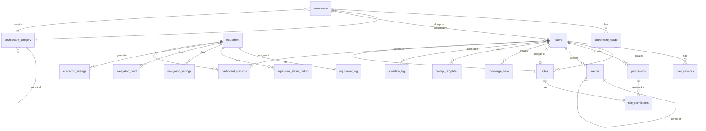

# 机器人管理系统数据库文档

本文档描述了机器人管理系统的数据库结构，包括表、字段、约束和关系等信息。

## 目录

1. [用户与权限管理](#用户与权限管理)
   - [users 表](#users-表)
   - [user_sessions 表](#user_sessions-表)
   - [roles 表](#roles-表)
   - [permissions 表](#permissions-表)
   - [role_permissions 表](#role_permissions-表)
   - [menus 表](#menus-表)
2. [设备管理](#设备管理)
3. [课件管理](#课件管理)
4. [知识库管理](#知识库管理)
5. [系统设置](#系统设置)
6. [日志与统计](#日志与统计)

## 用户与权限管理

### users 表

存储系统用户信息。

| 字段名 | 类型 | 约束 | 描述 |
|-------|------|------|------|
| id | Integer | 主键, 自增 | 用户ID |
| username | String(50) | 非空, 唯一 | 用户名 |
| password | String(255) | 非空 | 密码哈希 |
| real_name | String(100) | 非空 | 真实姓名 |
| email | String(100) | 唯一 | 邮箱地址 |
| phone | String(20) | | 手机号码 |
| role | Enum('admin', 'operator', 'viewer') | 非空, 默认'viewer' | 用户角色 |
| role_id | Integer | 外键(roles.id) | 角色ID |
| status | Boolean | 默认True | 用户状态: 1-启用, 0-禁用 |
| last_login | DateTime | | 最后登录时间 |
| login_count | Integer | 默认0 | 登录次数 |
| created_at | DateTime | 非空, 默认当前时间 | 创建时间 |
| updated_at | DateTime | 非空, 默认当前时间, 自动更新 | 更新时间 |

**关系：**
- 一个用户可以创建多个角色 (一对多关系，通过 roles.created_by)
- 一个用户可以创建多个权限 (一对多关系，通过 permissions.created_by)
- 一个用户可以创建多个菜单 (一对多关系，通过 menus.created_by)
- 一个用户可以拥有多个会话 (一对多关系，通过 user_sessions.user_id)
- 一个用户属于一个角色 (多对一关系，通过 role_id)

### user_sessions 表

存储用户会话信息。

| 字段名 | 类型 | 约束 | 描述 |
|-------|------|------|------|
| id | String(100) | 主键 | 会话ID |
| user_id | Integer | 外键(users.id), 非空 | 用户ID |
| token | String(500) | 非空 | 访问令牌 |
| refresh_token | String(500) | | 刷新令牌 |
| ip_address | String(50) | | 客户端IP地址 |
| user_agent | String(500) | | 用户代理 |
| device_info | String(200) | | 设备信息 |
| expires_at | DateTime | | 过期时间 |
| is_active | Boolean | 默认True | 是否活跃 |
| created_at | DateTime | 非空, 默认当前时间 | 创建时间 |
| updated_at | DateTime | 非空, 默认当前时间, 自动更新 | 更新时间 |

**关系：**
- 一个会话属于一个用户 (多对一关系，通过 user_id)

### roles 表

存储角色信息。

| 字段名 | 类型 | 约束 | 描述 |
|-------|------|------|------|
| id | Integer | 主键, 自增 | 角色ID |
| name | String(50) | 非空, 唯一 | 角色名称 |
| code | String(50) | 非空, 唯一 | 角色编码 |
| description | Text | | 角色描述 |
| is_system | Boolean | 默认False | 是否为系统内置角色 |
| status | Boolean | 默认True | 状态 |
| sort_order | Integer | 默认0 | 排序 |
| created_by | Integer | 外键(users.id) | 创建人 |
| created_at | DateTime | 非空, 默认当前时间 | 创建时间 |
| updated_at | DateTime | 非空, 默认当前时间, 自动更新 | 更新时间 |

**关系：**
- 一个角色可以分配给多个用户 (一对多关系，通过 users.role_id)
- 一个角色可以拥有多个权限 (多对多关系，通过 role_permissions 表)
- 一个角色由一个用户创建 (多对一关系，通过 created_by)

### permissions 表

存储权限信息。

| 字段名 | 类型 | 约束 | 描述 |
|-------|------|------|------|
| id | Integer | 主键, 自增 | 权限ID |
| name | String(100) | 非空 | 权限名称 |
| code | String(100) | 非空, 唯一 | 权限编码 |
| description | Text | | 权限描述 |
| module | String(50) | | 所属模块 |
| permission_type | Enum('menu', 'button', 'api') | 默认'button' | 权限类型 |
| resource_path | String(200) | | 资源路径 |
| method | String(10) | | 请求方法 |
| is_system | Boolean | 默认False | 是否为系统内置权限 |
| status | Boolean | 默认True | 状态 |
| sort_order | Integer | 默认0 | 排序 |
| created_by | Integer | 外键(users.id) | 创建人 |
| created_at | DateTime | 非空, 默认当前时间 | 创建时间 |
| updated_at | DateTime | 非空, 默认当前时间, 自动更新 | 更新时间 |

**关系：**
- 一个权限可以分配给多个角色 (多对多关系，通过 role_permissions 表)
- 一个权限由一个用户创建 (多对一关系，通过 created_by)

### role_permissions 表

角色和权限的关联表。

| 字段名 | 类型 | 约束 | 描述 |
|-------|------|------|------|
| id | Integer | 主键, 自增 | ID |
| role_id | Integer | 外键(roles.id), 非空 | 角色ID |
| permission_id | Integer | 外键(permissions.id), 非空 | 权限ID |
| created_at | DateTime | 非空, 默认当前时间 | 创建时间 |

**约束：**
- 联合唯一索引：(role_id, permission_id)

**关系：**
- 多对一关系到角色表 (通过 role_id)
- 多对一关系到权限表 (通过 permission_id)

### menus 表

存储系统菜单信息。

| 字段名 | 类型 | 约束 | 描述 |
|-------|------|------|------|
| id | Integer | 主键, 自增 | 菜单ID |
| name | String(100) | 非空 | 菜单名称 |
| title | String(100) | 非空 | 菜单标题 |
| path | String(200) | | 路由路径 |
| component | String(200) | | 组件路径 |
| icon | String(100) | | 菜单图标 |
| parent_id | Integer | 外键(menus.id) | 父菜单ID |
| sort_order | Integer | 默认0 | 排序 |
| menu_type | Enum('directory', 'menu', 'button') | 默认'menu' | 菜单类型 |
| is_hidden | Boolean | 默认False | 是否隐藏 |
| is_keepalive | Boolean | 默认True | 是否缓存 |
| is_affix | Boolean | 默认False | 是否固定标签 |
| redirect | String(200) | | 重定向路径 |
| permission_code | String(100) | | 权限编码 |
| status | Boolean | 默认True | 状态 |
| created_by | Integer | 外键(users.id) | 创建人 |
| created_at | DateTime | 非空, 默认当前时间 | 创建时间 |
| updated_at | DateTime | 非空, 默认当前时间, 自动更新 | 更新时间 |

**关系：**
- 自引用关系：一个菜单可以有多个子菜单 (通过 parent_id)
- 一个菜单由一个用户创建 (多对一关系，通过 created_by)

## 设备管理

### equipment 表

存储设备信息。

| 字段名 | 类型 | 约束 | 描述 |
|-------|------|------|------|
| id | String(50) | 主键 | 设备唯一标识，如G1-EDU-001 |
| location | String(255) | 非空 | 设备所在位置 |
| status | String(50) | | 设备当前状态 |
| ip_address | String(50) | | IP地址 |
| last_active | DateTime | | 最后活跃时间 |
| usage_rate | String(10) | | 使用率 |
| is_offline | Boolean | 默认False | 离线状态: 1-离线, 0-在线 |
| has_error | Boolean | 默认False | 错误状态: 1-有错误, 0-正常 |
| created_at | DateTime | 非空, 默认当前时间 | 创建时间 |
| updated_at | DateTime | 非空, 默认当前时间, 自动更新 | 更新时间 |

**关系：**
- 一个设备可以有多个设备日志 (一对多关系，通过 equipment_logs.equipment_id)
- 一个设备可以有多个教育设置 (一对多关系，通过 education_settings.equipment_id)
- 一个设备可以有多个导航设置 (一对多关系，通过 navigation_settings.equipment_id)
- 一个设备可以有多个导航点 (一对多关系，通过 navigation_points.equipment_id)

### equipment_log 表

存储设备日志信息。

| 字段名 | 类型 | 约束 | 描述 |
|-------|------|------|------|
| id | Integer | 主键, 自增 | 日志ID |
| equipment_id | String(50) | 外键(equipment.id), 非空 | 设备ID |
| log_type | String(50) | 非空 | 日志类型 |
| content | Text | 非空 | 日志内容 |
| level | String(20) | 默认'info' | 日志级别 |
| created_at | DateTime | 非空, 默认当前时间 | 创建时间 |

**关系：**
- 一个日志属于一个设备 (多对一关系，通过 equipment_id)

### equipment_status_history 表

存储设备状态历史记录。

| 字段名 | 类型 | 约束 | 描述 |
|-------|------|------|------|
| id | Integer | 主键, 自增 | 历史记录ID |
| equipment_id | String(50) | 外键(equipment.id), 非空 | 设备ID |
| status | String(50) | 非空 | 设备状态 |
| cpu_usage | Float | | CPU使用率 |
| memory_usage | Float | | 内存使用率 |
| disk_usage | Float | | 磁盘使用率 |
| network_status | String(50) | | 网络状态 |
| battery_level | Integer | | 电池电量 |
| temperature | Float | | 温度 |
| is_online | Boolean | 默认True | 是否在线 |
| has_error | Boolean | 默认False | 是否有错误 |
| error_code | String(50) | | 错误代码 |
| error_message | Text | | 错误信息 |
| created_at | DateTime | 非空, 默认当前时间 | 创建时间 |

**关系：**
- 一个状态历史记录属于一个设备 (多对一关系，通过 equipment_id)

### navigation_settings 表

存储导航设置信息。

| 字段名 | 类型 | 约束 | 描述 |
|-------|------|------|------|
| id | Integer | 主键, 自增 | 设置ID |
| equipment_id | String(50) | 外键(equipment.id), 非空 | 设备ID |
| map_file | String(500) | | 地图文件路径 |
| navigation_mode | String(50) | 默认'auto' | 导航模式 |
| speed_level | Integer | 默认5 | 速度级别(1-10) |
| obstacle_detection | Boolean | 默认True | 障碍物检测 |
| auto_return | Boolean | 默认True | 自动返航 |
| voice_guidance | Boolean | 默认True | 语音引导 |
| status | Boolean | 默认True | 状态 |
| created_at | DateTime | 非空, 默认当前时间 | 创建时间 |
| updated_at | DateTime | 非空, 默认当前时间, 自动更新 | 更新时间 |

**关系：**
- 一个导航设置属于一个设备 (多对一关系，通过 equipment_id)

### navigation_point 表

存储导航点信息。

| 字段名 | 类型 | 约束 | 描述 |
|-------|------|------|------|
| id | Integer | 主键, 自增 | 导航点ID |
| equipment_id | String(50) | 外键(equipment.id), 非空 | 设备ID |
| name | String(100) | 非空 | 导航点名称 |
| x_coordinate | Float | 非空 | X坐标 |
| y_coordinate | Float | 非空 | Y坐标 |
| description | Text | | 描述 |
| created_at | DateTime | 非空, 默认当前时间 | 创建时间 |

**关系：**
- 一个导航点属于一个设备 (多对一关系，通过 equipment_id)

## 课件管理

### courseware 表

存储课件信息。

| 字段名 | 类型 | 约束 | 描述 |
|-------|------|------|------|
| id | Integer | 主键, 自增 | 课件ID |
| title | String(255) | 非空 | 课件标题 |
| category_id | Integer | 外键(courseware_categories.id) | 分类ID |
| file_path | String(500) | 非空 | 文件存储路径 |
| file_name | String(255) | 非空 | 原始文件名 |
| file_type | String(50) | 非空 | 文件类型 |
| file_size | BigInteger | 非空 | 文件大小(字节) |
| mime_type | String(100) | | MIME类型 |
| description | Text | | 课件描述 |
| tags | String(500) | | 标签，逗号分隔 |
| subject | String(100) | | 学科 |
| grade_level | String(50) | | 年级水平 |
| duration | Integer | | 播放时长(秒) |
| thumbnail_path | String(500) | | 缩略图路径 |
| download_count | Integer | 默认0 | 下载次数 |
| view_count | Integer | 默认0 | 查看次数 |
| is_public | Boolean | 默认True | 是否公开 |
| status | Enum('draft', 'published', 'archived') | 默认'published' | 状态 |
| uploaded_by | Integer | 外键(users.id) | 上传用户ID |
| created_at | DateTime | 非空, 默认当前时间 | 创建时间 |
| updated_at | DateTime | 非空, 默认当前时间, 自动更新 | 更新时间 |

**关系：**
- 一个课件属于一个分类 (多对一关系，通过 category_id)
- 一个课件由一个用户上传 (多对一关系，通过 uploaded_by)
- 一个课件可以有多个使用记录 (一对多关系，通过 courseware_usage.courseware_id)

### courseware_category 表

存储课件分类信息。

| 字段名 | 类型 | 约束 | 描述 |
|-------|------|------|------|
| id | Integer | 主键, 自增 | 分类ID |
| name | String(100) | 非空 | 分类名称 |
| code | String(50) | 唯一 | 分类编码 |
| description | Text | | 分类描述 |
| parent_id | Integer | 外键(courseware_categories.id) | 父分类ID |
| icon | String(200) | | 图标路径 |
| sort_order | Integer | 默认0 | 排序 |
| status | Boolean | 默认True | 状态 |
| created_by | Integer | 外键(users.id) | 创建人 |
| created_at | DateTime | 非空, 默认当前时间 | 创建时间 |
| updated_at | DateTime | 非空, 默认当前时间, 自动更新 | 更新时间 |

**关系：**
- 自引用关系：一个分类可以有多个子分类 (通过 parent_id)
- 一个分类可以包含多个课件 (一对多关系，通过 courseware.category_id)
- 一个分类由一个用户创建 (多对一关系，通过 created_by)

### courseware_usage 表

存储课件使用记录。

| 字段名 | 类型 | 约束 | 描述 |
|-------|------|------|------|
| id | Integer | 主键, 自增 | 记录ID |
| courseware_id | Integer | 外键(courseware.id), 非空 | 课件ID |
| equipment_id | String(50) | 外键(equipment.id) | 设备ID |
| user_id | Integer | 外键(users.id) | 用户ID |
| usage_type | String(50) | 非空 | 使用类型 |
| start_time | DateTime | 非空, 默认当前时间 | 开始时间 |
| end_time | DateTime | | 结束时间 |
| duration | Integer | | 使用时长(秒) |
| progress | Float | 默认0 | 进度(0-100%) |
| completed | Boolean | 默认False | 是否完成 |
| rating | Integer | | 评分(1-5) |
| feedback | Text | | 反馈内容 |
| session_id | String(100) | | 会话ID |
| created_at | DateTime | 非空, 默认当前时间 | 创建时间 |
| updated_at | DateTime | 非空, 默认当前时间, 自动更新 | 更新时间 |

**关系：**
- 一个使用记录属于一个课件 (多对一关系，通过 courseware_id)
- 一个使用记录可能关联一个设备 (多对一关系，通过 equipment_id)
- 一个使用记录可能关联一个用户 (多对一关系，通过 user_id)

### education_settings 表

存储教育设置信息。

| 字段名 | 类型 | 约束 | 描述 |
|-------|------|------|------|
| id | Integer | 主键, 自增 | 设置ID |
| equipment_id | String(50) | 外键(equipment.id), 非空 | 设备ID |
| auto_play | Boolean | 默认True | 自动播放 |
| volume_level | Integer | 默认80 | 音量级别(0-100) |
| default_subject | String(100) | | 默认学科 |
| default_grade | String(50) | | 默认年级 |
| screen_timeout | Integer | 默认300 | 屏幕超时时间(秒) |
| status | Boolean | 默认True | 状态 |
| created_at | DateTime | 非空, 默认当前时间 | 创建时间 |
| updated_at | DateTime | 非空, 默认当前时间, 自动更新 | 更新时间 |

**关系：**
- 一个教育设置属于一个设备 (多对一关系，通过 equipment_id)

## 知识库管理

### knowledge_base 表

存储知识库信息。

| 字段名 | 类型 | 约束 | 描述 |
|-------|------|------|------|
| id | Integer | 主键, 自增 | 知识库ID |
| title | String(255) | 非空 | 标题 |
| content | Text | 非空 | 内容 |
| description | Text | | 描述 |
| category | String(100) | | 分类 |
| tags | String(500) | | 标签，逗号分隔 |
| type | Enum('text', 'document', 'link', 'faq') | 默认'text' | 知识类型 |
| status | Enum('draft', 'published', 'archived') | 默认'published' | 状态 |
| priority | Integer | 默认0 | 优先级 |
| view_count | Integer | 默认0 | 查看次数 |
| usage_count | Integer | 默认0 | 使用次数 |
| is_public | Boolean | 默认True | 是否公开 |
| source_url | String(500) | | 来源链接 |
| source_type | String(50) | | 来源类型 |
| created_by | Integer | 外键(users.id) | 创建用户ID |
| updated_by | Integer | 外键(users.id) | 更新用户ID |
| created_at | DateTime | 非空, 默认当前时间 | 创建时间 |
| updated_at | DateTime | 非空, 默认当前时间, 自动更新 | 更新时间 |

**关系：**
- 一个知识库由一个用户创建 (多对一关系，通过 created_by)
- 一个知识库由一个用户更新 (多对一关系，通过 updated_by)

### prompt_templates 表

存储提示词模板信息。

| 字段名 | 类型 | 约束 | 描述 |
|-------|------|------|------|
| id | Integer | 主键, 自增 | 模板ID |
| title | String(255) | 非空 | 标题 |
| content | Text | 非空 | 模板内容 |
| description | Text | | 描述 |
| category | String(100) | | 分类 |
| tags | String(500) | | 标签，逗号分隔 |
| type | Enum('system', 'user', 'assistant', 'general') | 默认'general' | 模板类型 |
| status | Enum('draft', 'published', 'archived') | 默认'published' | 状态 |
| priority | Integer | 默认0 | 优先级 |
| view_count | Integer | 默认0 | 查看次数 |
| usage_count | Integer | 默认0 | 使用次数 |
| is_public | Boolean | 默认True | 是否公开 |
| variables | Text | | 变量定义JSON |
| example_input | Text | | 示例输入 |
| example_output | Text | | 示例输出 |
| model_type | String(50) | | 适用模型类型 |
| temperature | Float | 默认0.7 | 温度参数 |
| max_tokens | Integer | | 最大token数 |
| created_by | Integer | 外键(users.id) | 创建用户ID |
| updated_by | Integer | 外键(users.id) | 更新用户ID |
| created_at | DateTime | 非空, 默认当前时间 | 创建时间 |
| updated_at | DateTime | 非空, 默认当前时间, 自动更新 | 更新时间 |

**关系：**
- 一个提示词模板由一个用户创建 (多对一关系，通过 created_by)
- 一个提示词模板由一个用户更新 (多对一关系，通过 updated_by)

## 系统设置

### system_settings 表

存储系统设置信息。

| 字段名 | 类型 | 约束 | 描述 |
|-------|------|------|------|
| id | Integer | 主键, 自增 | 设置ID |
| key | String(100) | 非空, 唯一 | 设置键名 |
| value | Text | | 设置值 |
| description | Text | | 描述 |
| category | String(100) | | 分类 |
| is_public | Boolean | 默认True | 是否公开 |
| status | Boolean | 默认True | 状态 |
| created_by | Integer | 外键(users.id) | 创建人 |
| updated_by | Integer | 外键(users.id) | 更新人 |
| created_at | DateTime | 非空, 默认当前时间 | 创建时间 |
| updated_at | DateTime | 非空, 默认当前时间, 自动更新 | 更新时间 |

**关系：**
- 一个系统设置由一个用户创建 (多对一关系，通过 created_by)
- 一个系统设置由一个用户更新 (多对一关系，通过 updated_by)

## 日志与统计

### operation_log 表

存储操作日志信息。

| 字段名 | 类型 | 约束 | 描述 |
|-------|------|------|------|
| id | Integer | 主键, 自增 | 日志ID |
| user_id | Integer | 外键(users.id) | 用户ID |
| username | String(50) | | 用户名 |
| operation | String(100) | 非空 | 操作类型 |
| resource_type | String(50) | | 资源类型 |
| resource_id | String(50) | | 资源ID |
| description | Text | | 操作描述 |
| ip_address | String(50) | | IP地址 |
| user_agent | String(500) | | 用户代理 |
| status | String(20) | 默认'success' | 操作状态 |
| error_message | Text | | 错误信息 |
| created_at | DateTime | 非空, 默认当前时间 | 创建时间 |

**关系：**
- 一个操作日志可能关联一个用户 (多对一关系，通过 user_id)

### dashboard_statistics 表

存储仪表盘统计数据。

| 字段名 | 类型 | 约束 | 描述 |
|-------|------|------|------|
| id | Integer | 主键, 自增 | 统计ID |
| stat_date | Date | 非空 | 统计日期 |
| stat_type | String(50) | 非空 | 统计类型 |
| stat_key | String(100) | 非空 | 统计键名 |
| stat_value | Float | | 统计值 |
| equipment_id | String(50) | 外键(equipment.id) | 设备ID |
| user_id | Integer | 外键(users.id) | 用户ID |
| resource_id | String(50) | | 资源ID |
| resource_type | String(50) | | 资源类型 |
| data_json | Text | | 详细数据(JSON) |
| created_at | DateTime | 非空, 默认当前时间 | 创建时间 |
| updated_at | DateTime | 非空, 默认当前时间, 自动更新 | 更新时间 |

**关系：**
- 一个统计数据可能关联一个设备 (多对一关系，通过 equipment_id)
- 一个统计数据可能关联一个用户 (多对一关系，通过 user_id)

### result 表

存储通用结果信息。

| 字段名 | 类型 | 约束 | 描述 |
|-------|------|------|------|
| id | Integer | 主键, 自增 | 结果ID |
| user_id | Integer | 外键(users.id) | 用户ID |
| equipment_id | String(50) | 外键(equipment.id) | 设备ID |
| result_type | String(50) | 非空 | 结果类型 |
| data | Text | | 结果数据 |
| status | String(20) | 默认'success' | 状态 |
| created_at | DateTime | 非空, 默认当前时间 | 创建时间 |

**关系：**
- 一个结果可能关联一个用户 (多对一关系，通过 user_id)
- 一个结果可能关联一个设备 (多对一关系，通过 equipment_id)

## 数据库关系图

以下是主要表之间的关系图：

## 总结

本文档详细描述了机器人管理系统的数据库结构，包括：

1. **用户与权限管理**：用户表、会话表、角色表、权限表、角色权限关联表和菜单表，实现了基于RBAC的权限管理系统。

2. **设备管理**：设备表、设备日志表、设备状态历史表、导航设置表和导航点表，实现了对机器人设备的全面管理。

3. **课件管理**：课件表、课件分类表、课件使用记录表和教育设置表，实现了教育资源的管理和使用跟踪。

4. **知识库管理**：知识库表和提示词模板表，存储系统中使用的知识和AI提示模板。

5. **系统设置**：系统设置表，存储全局配置信息。

6. **日志与统计**：操作日志表、仪表盘统计表和结果表，记录系统操作和统计数据。

数据库设计遵循了关系型数据库的设计原则，使用外键约束保证数据完整性，通过合理的表结构设计支持系统的各项功能。
